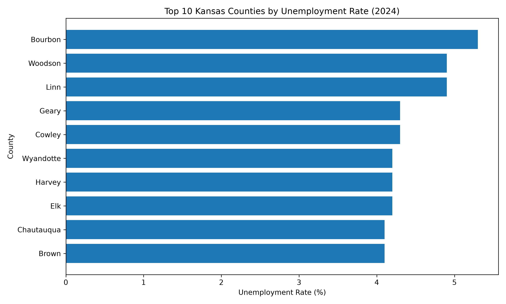
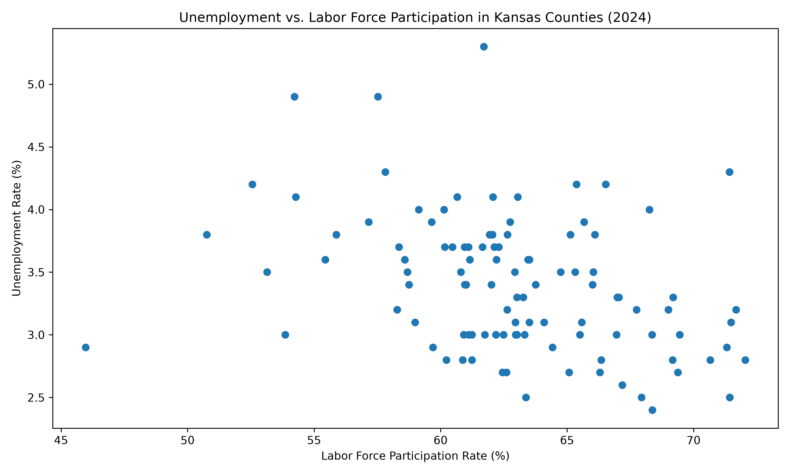
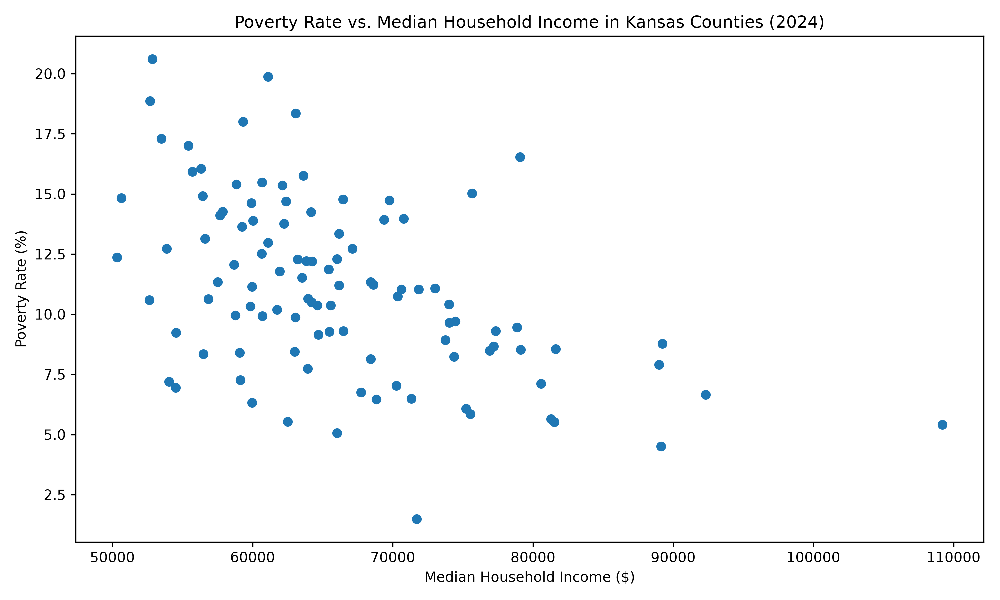
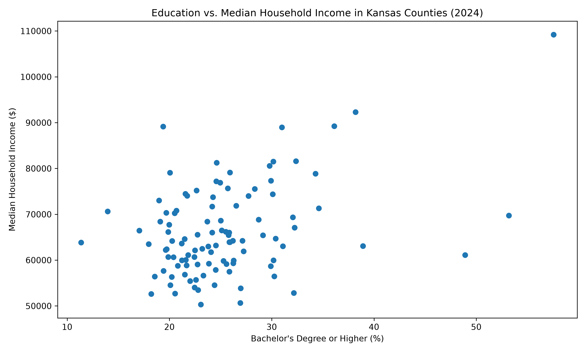

# Kansas Economic and Workforce Trends Analysis

## Project Overview

This project analyzes economic and workforce conditions across all 105 Kansas counties using 2024 data from the U.S. Census Bureau American Community Survey (ACS) and the Bureau of Labor Statistics Local Area Unemployment Statistics (BLS LAUS).

The analysis examines county-level differences in population, household income, labor-force participation, unemployment, poverty, and educational attainment.

Python, SQL, statistical analysis, regression modeling, and data visualization are used to identify patterns and relationships among these indicators.

## Main Research Question

How do economic and workforce conditions vary across Kansas counties, and which factors are associated with higher or lower unemployment rates?

## Data Sources

### U.S. Census Bureau — American Community Survey (ACS)

2024 ACS 5-Year Estimates were used for county-level demographic and socioeconomic measures, including:

- Population
- Median household income
- Labor-force participation
- Unemployment
- Poverty
- Educational attainment

### Bureau of Labor Statistics — Local Area Unemployment Statistics (BLS LAUS)

2024 BLS LAUS data were used for county-level labor-market measures, including:

- Labor force
- Employment
- Unemployment
- Unemployment rate

### BLS Raw Data Note

The BLS extraction script:

`scripts/02_extract_bls.py`

requires the 2024 Local Area Unemployment Statistics county annual averages Excel file.

The raw file should be saved as:

`data/raw/laucnty24.xlsx`

The repository includes the processed Kansas county-level BLS dataset in:

`data/processed/bls_2024_kansas_counties.csv`

## Tools and Technologies

- Python
- pandas
- Statsmodels
- Matplotlib
- SQL
- SQLite
- Jupyter Notebook
- Visual Studio Code
- Git
- GitHub

## Data Preparation

The project includes a reproducible data-processing workflow that:

1. Extracts Census ACS county data
2. Processes BLS LAUS data
3. Cleans and standardizes variables
4. Standardizes county FIPS codes
5. Merges Census and BLS datasets
6. Validates the final dataset across all 105 Kansas counties
7. Loads the cleaned dataset into SQLite for SQL analysis

## Analysis

The project includes:

- Exploratory data analysis
- County-level rankings
- Correlation analysis
- Multiple linear regression
- Multicollinearity diagnostics using VIF
- Data visualization
- SQL-based county analysis

The SQL analysis addresses four main questions:

1. Which Kansas counties had the highest unemployment rates?
2. Which counties had both above-average unemployment and above-average poverty?
3. Which counties had the lowest labor-force participation rates?
4. Which counties had the highest bachelor's-or-higher educational attainment rates, and what were their median household incomes?

## Key Results

- Economic and workforce indicators were analyzed across all 105 Kansas counties.
- Labor-force participation had the strongest statistically significant relationship with county unemployment in the regression model (`p = 0.002`).
- The regression model was statistically significant overall (`p < 0.001`).
- The model explained approximately 17.5% of the variation in county unemployment rates (`R² = 0.175`).
- County unemployment showed a positive correlation with poverty of approximately `+0.23`.
- County unemployment showed a negative correlation with median household income of approximately `-0.28`.
- County unemployment showed a negative correlation with labor-force participation of approximately `-0.35`.
- Poverty and median household income showed a stronger negative relationship of approximately `-0.49`.
- Johnson County had the highest bachelor's-or-higher educational attainment rate in the dataset at approximately 57.56%.
- Bourbon County had the highest 2024 BLS unemployment rate in the analysis at 5.3%.

## Key Findings

The analysis suggests that Kansas counties with higher labor-force participation tended to have lower unemployment rates.

Median household income also showed a negative relationship with unemployment, while poverty showed a positive relationship with unemployment.

Educational attainment was positively associated with median household income and labor-force participation.

In the multiple regression model, labor-force participation showed the clearest independent association with county unemployment.

Because the model explained only about 17.5% of the variation in unemployment rates, additional local economic, demographic, and industry factors likely contribute to differences across Kansas counties.

## Visual Results

### Top 10 Kansas Counties by Unemployment Rate



### Unemployment vs. Labor-Force Participation



### Poverty vs. Median Household Income



### Educational Attainment vs. Median Household Income



## Project Structure

```text
Kansas Economic and Workforce Trends Analysis/
│
├── data/
│   ├── raw/
│   └── processed/
│
├── dashboard/
│
├── notebooks/
│   └── 01_kansas_economic_workforce_analysis.ipynb
│
├── outputs/
│   ├── charts/
│   └── tables/
│
├── reports/
│
├── scripts/
│   ├── 01_extract_census.py
│   ├── 02_extract_bls.py
│   ├── 03_clean_merge_data.py
│   ├── 04_validate_data.py
│   ├── 05_analyze_counties.py
│   ├── 06_create_charts.py
│   ├── 07_load_sqlite.py
│   ├── 08_regression_analysis.py
│   └── 09_export_results.py
│
├── sql/
│   └── 01_county_analysis.sql
│
├── requirements.txt
└── README.md

